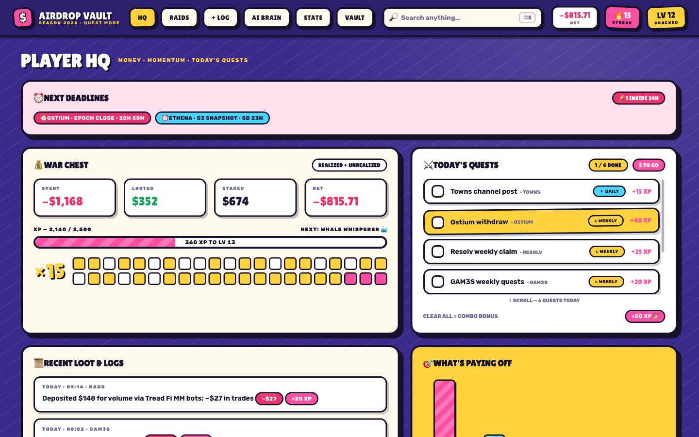
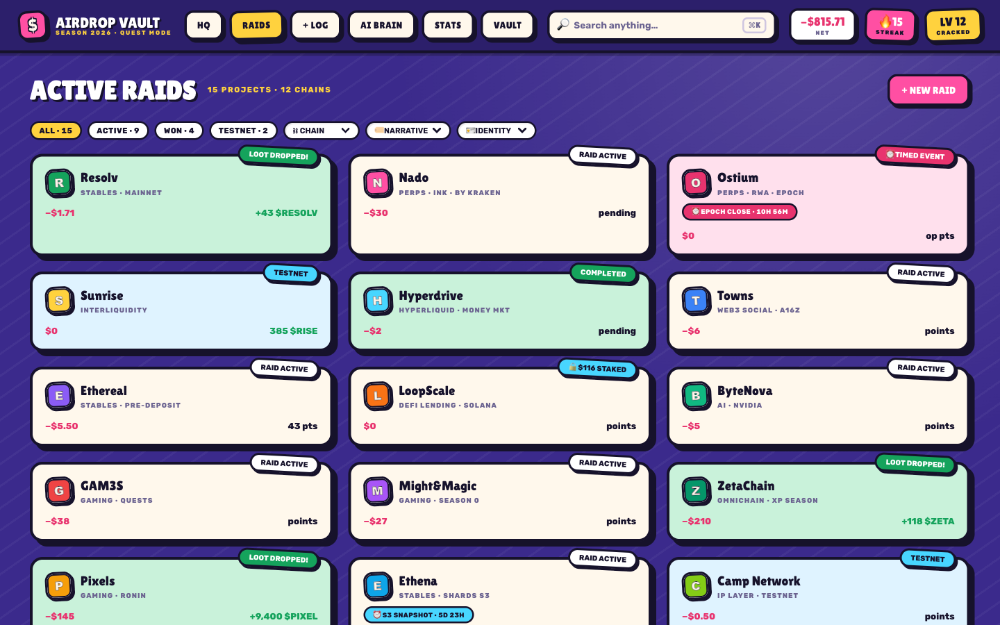
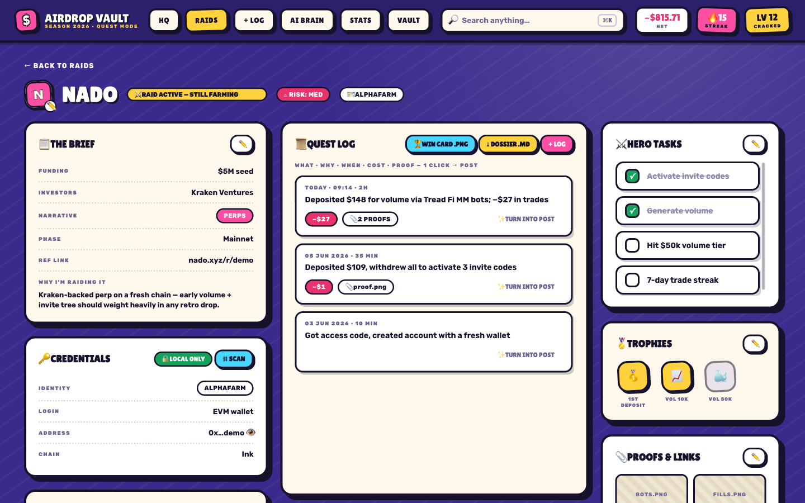
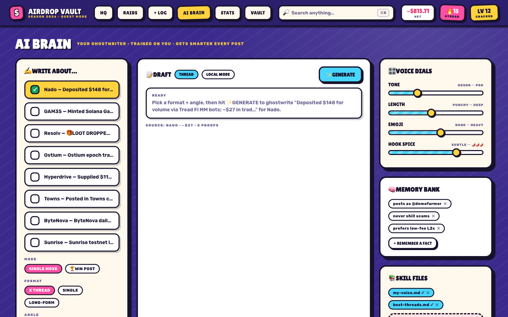
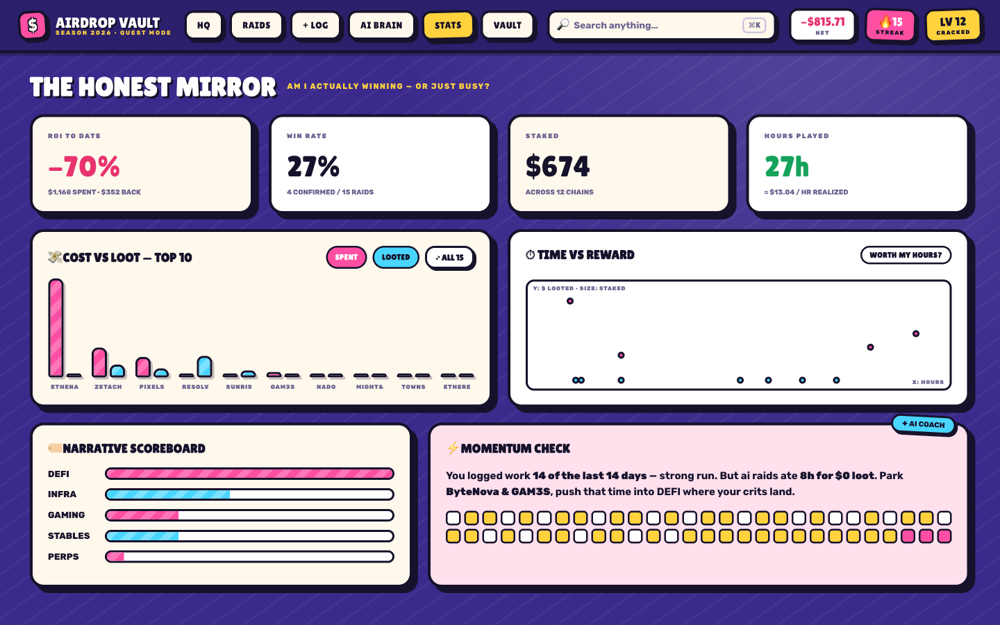

# ⚔️ Airdrop Vault — Quest Mode

**A local-first airdrop farming tracker that turns the grind into a game.**

Track every protocol you farm, every move you make, and every dollar in and
out — as quests, raids, XP, streaks, and trophies. All your data lives in
plain files on **your own machine**. No accounts, no cloud, no telemetry,
nothing leaves your computer.

Built in a chunky game-menu style: thick outlines, hard shadows, tilted chips.

**▶ [Try the live demo](https://ilhanedu.github.io/airdropvault/)** — runs entirely
in your browser on demo data, nothing to install. (The browser demo uses
`localStorage`; the local file backend kicks in when you run it yourself.)



## Why farmers use it

- **Sybil-safe by design** — wallet addresses, proof screenshots, and notes
  never touch a server. Your vault is a folder of JSON + markdown + images
  you can back up, encrypt, or sync however you like.
- **🛡 Sybil Shield** — automated hygiene checks: flags wallets shared
  between identities, raids farmed by multiple personas, and logs filed
  under the wrong identity — before a protocol's sybil filter finds them.
- **⏰ Real deadlines** — set a snapshot / epoch close / claim cutoff per
  raid and get live countdowns on the raid card, the detail header, and an
  HQ deadline rail that goes alarm-red inside 24 hours. Never miss a
  snapshot again.
- **⛓ Wallet scanner** — one free Etherscan key unlocks read-only tx
  history on 25+ EVM chains. Pull real on-chain moves into your quest log
  with their actual timestamp and tx hash as proof, instead of typing them.
- **📈 Live loot pricing** — attach a CoinGecko coin id to any raid and the
  MONEY card shows what your bag is worth right now (free API, no key).
- **The honest mirror** — ROI, win rate, cost-vs-loot, and time-vs-reward
  are computed from your real entries. See which farms pay and which ones
  eat your hours.
- **Receipts forever** — every contribution is written into per-protocol
  dossiers (markdown), so when a project asks "prove you were early," you
  have the full timeline with screenshots.
- **🏆 Win cards** — one click renders a raid's stats (spent, looted, ROI,
  hours, days in) as a 1200×675 PNG in the quest style, ready to post next
  to your win announcement.
- **CSV import** — escaping a spreadsheet? Import date / protocol / what /
  cost / minutes / chain / loot columns and raids are created automatically.
- **AI ghostwriter** — turn any logged move or a full protocol dossier into
  a thread / win post, in your voice. Bring your own API key (Anthropic,
  OpenAI, Gemini, or any OpenAI-compatible endpoint) — or use the built-in
  offline ghostwriter with no key at all.

## Quick start

Requires [Node.js](https://nodejs.org) 18+.

```bash
git clone https://github.com/ilhanEdu/airdropvault.git
cd airdropvault
npm install
npm run dev      # http://localhost:5173 — UI + local file backend in one command
```

Other scripts:

```bash
npm run build    # production build in dist/
npm run preview  # serve the built app (file backend included)
```

First run is seeded with **demo data** so you can explore every screen.
When you're ready to farm for real, open **Vault → reset** to start from a
blank slate — or just start editing; it's all yours.

## The screens

> Screens below are the built-in demo data — the same vault you get on the
> [live demo](https://ilhanedu.github.io/airdropvault/).

**HQ** — TODAY'S QUESTS is a to-do list built from your grind: logging a
move as ☀ DAILY or ↻ WEEKLY in + LOG puts it here automatically. Daily
tasks resurface every day, weekly ones 7 days after completion. Clearing
everything pays the +50 combo. XP bar with level titles, streak heatmap,
recent logs.


**Raids** — one card per protocol you farm. Status / chain / narrative /
identity filters, + NEW RAID creation, click any card for the full detail
screen.



**Raid detail** — brief (funding, investors, why you're farming it),
credentials (address reveal on click), money, quest log, toggleable hero
tasks (+20 XP), trophies, proofs & links, ⤓ DOSSIER .MD export.



**+ Log** — quick-action chips autofill the form; drag-and-drop
screenshots and they're **saved as real files** into that protocol's
`media/` folder, or paste a tx hash; pick a REPEAT (one-time / daily /
weekly) to feed the HQ quest list; live reward preview, XP pop + confetti
on save. Costs flow into the raid's money (stakes count as staked, not
burnt).

**AI Brain** — pick any logged entry, format (thread / single / long-form)
and angle, drag the voice dials, hit ✨ GENERATE. Memory bank facts +
skill files feed every generation. **🏆 WIN POST mode** hands the AI the
protocol's entire contribution dossier to write your eligibility/payout
announcement from the full history.



**Stats** — the honest mirror. Cost-vs-loot for your top raids, with a
full-screen scrollable chart that scales to 100+ protocols. Coach copy is
computed from your actual time sinks.



**Vault** — export / import JSON backups, identities (multi-wallet
personas), custom fields, trophy rules, AI provider + key.

## Storage — your files are the backend

When run with `npm run dev` (or `npm run preview`), everything autosaves to
real files under `vault-data/` in this folder:

```
vault-data/                 # gitignored — never leaves your machine
  state.json                # the whole vault — single source of truth
  MASTER-DOSSIER.md         # every contribution across all protocols, regenerated on save
  raids/<protocol>/         # one folder per protocol, created automatically
    dossier.md              # that protocol's full contribution record
    media/                  # your uploaded proof screenshots
```

`localStorage` (`airdrop-vault-v1`) is kept as a fallback cache, so the app
still works if you open the built `dist/` without the file backend. Export a
JSON backup or the master dossier from the Vault screen any time.

## Security notes (read this)

- `vault-data/` is **gitignored**. If you fork this repo, keep it that way —
  it holds your addresses, screenshots, and AI key.
- Your AI API key is stored **in plaintext** in `vault-data/state.json` and
  used directly from the browser against your provider. That's fine for a
  local single-user tool, but treat the folder accordingly: don't share it,
  don't screenshot it, use a key with a spend limit.
- The app binds to localhost via Vite's dev server. Don't expose the port
  to the internet.

## Contributing

Issues and PRs welcome — especially from farmers who use it daily. The
codebase is small on purpose: React 18 + Vite + TypeScript, one CSS file,
a ~130-line file-storage API, zero other runtime dependencies.

## License

[MIT](LICENSE)
